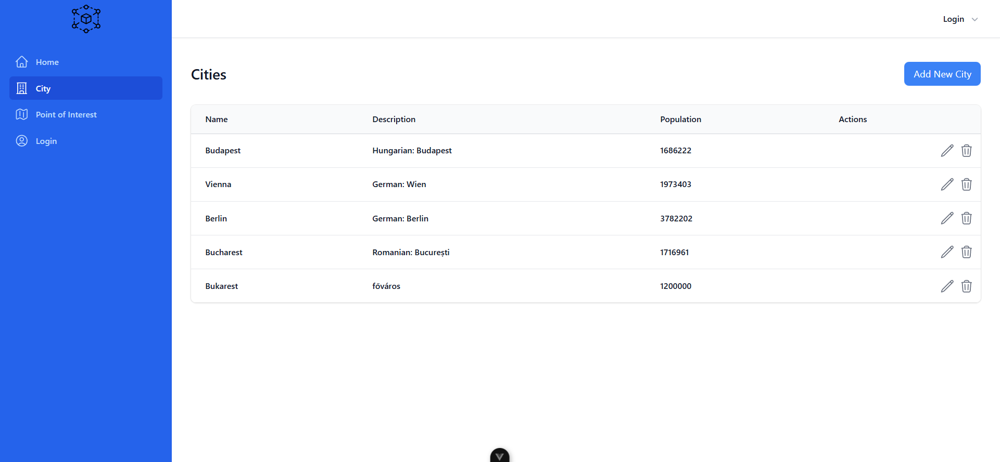
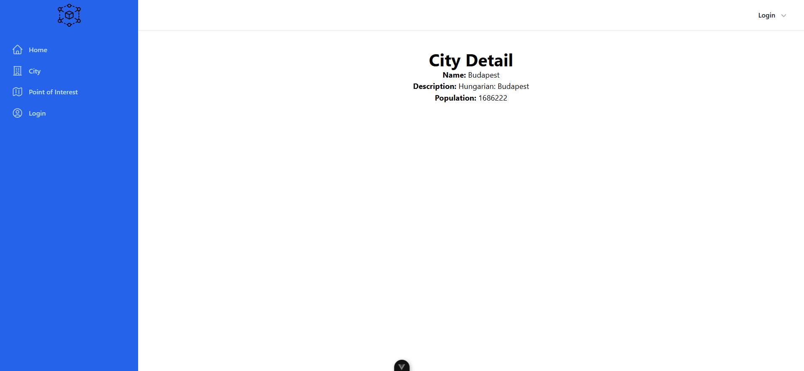
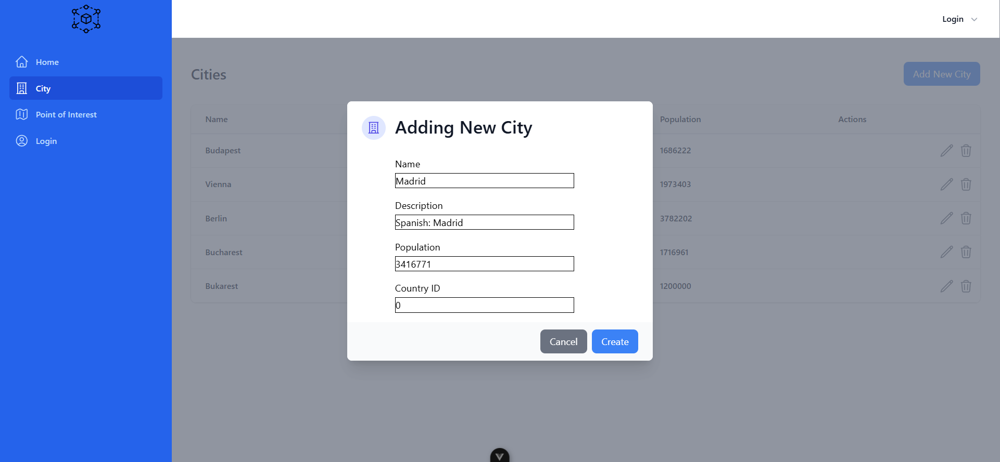
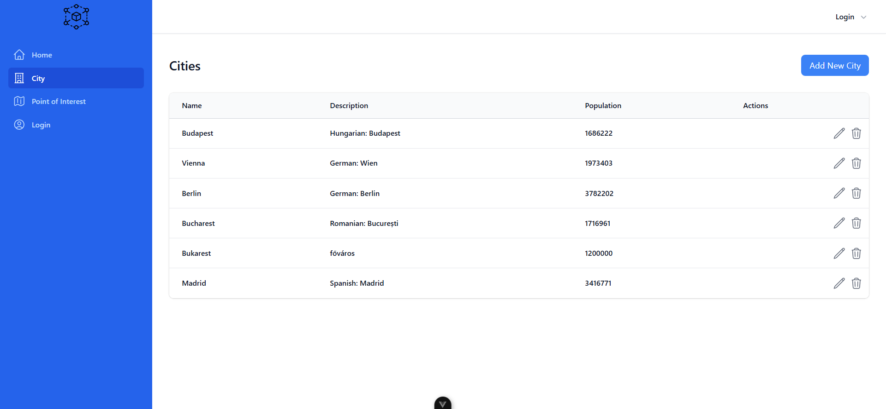
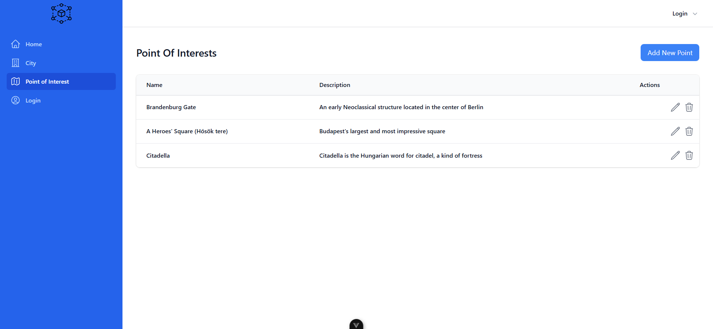
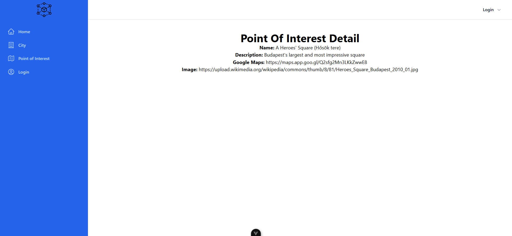

# Styxa projekt - Full-Stack Web App (Vue + Node.js + PostgreSQL)

Ez a projekt a **3 hónapos Styxa IT Intro kurzus zárófeladataként készült**, ahol önállóan építettem fel egy **full-stack webalkalmazást modern technológiákkal** (Tailwind CSS, Vue.js, Node.js/Express, PostgreSQL).

## 🎯 Projekt célja
A felhasználók:
 - bejelentkezhetnek a City oldalra
 - új városokat adhatnak hozzá
 - adatokat tárolhatnak az általuk rögzített városokról
 - egy városra kattintva megtekinthetik annak részletes információit

## 🖼️ Funkciók (képernyőképekkel)

### 1️⃣ Home oldal
 - A főoldal bemutatja a projekt célját és a használt technológiákat.
 - Tartalmaz egy **„Styxa” gombot**, amelyre kattintva a felhasználó átirányítódik a Styxa oldalára.

### 2️⃣ City oldal - Városok listázása
 - A felhasználó megtekintheti az adatbázisban tárolt összes várost.
 - A lista elemei kattinthatóak.

### 3️⃣ City oldal - Város részletei
 - Egy városra kattintva megjelennek a részletes adatok:
   - város neve
   - megjegyzés
   - népességszám

### 4️⃣ City oldal - Új város hozzáadása
 - A **„Add New City”** gomb segítségével egy űrlap jelenik meg.
 - Itt a felhasználó új várost küldhet be a rendszernek.

### 5️⃣ City oldal - Új város azonnali megjelenése
 - A beküldés után az új város **azonnal megjelenik** a városok listájában (pl.: Madrid).

### 6️⃣ City oldal - Új város részleteinek megtekintése
 - Az újonnan hozzáadott város is kattintható.
 - Megjelennek ugyanúgy a részletek, mint a többi városnál.

### 7️⃣ Point of Interest oldal - Érdekességek listázása
 - Az oldal a városokhoz hasonló módon működik.
 - A felhasználó megtekintheti a rögzített érdekességeket.
 - A **„Add New Point”** gombbal egy űrlap jelenik meg, amelyen keresztül új érdekességet küldhet a szervernek.

### 8️⃣ Point of Interest oldal - Érdekesség részletei
 - Kattintás után látható az adott érdekesség részletes nézete:
   - név
   - megjegyzés
   - térkép
   - fotó (URL)

## 🔧 Mit tanultam a projekt fejlesztése során
**Ez a projekt különösen sokat segített a következők mélyebb megértésében:**
 - Vue komponens-struktúra és eseménykezelés
 - API-hívások készítése és kommunikáció a Node.js backenddel
 - Adatbázis-kezelés PostgreSQL-ben
 - Full-stack alkalmazás felépítése a frontendtől a szerverig
 - Tailwind használata gyors UI-készítéshez

## 🚀 Technológiák
 - **Frontend:** Vue 3, Tailwind CSS
 - **Backend:** Node.js, Express
 - **Adatbázis:** PostgreSQL
 - **Kommunikáció:** REST API

## ⚠️ Élő demo

A projekt jelenleg **nem érhető el online**, mert a frontend és backend külön mappában fut és a konfiguráció nem ideális deployhoz.
A projektet **személyesen vagy helyi futtatással** tudom bemutatni.

Gál Sándor
