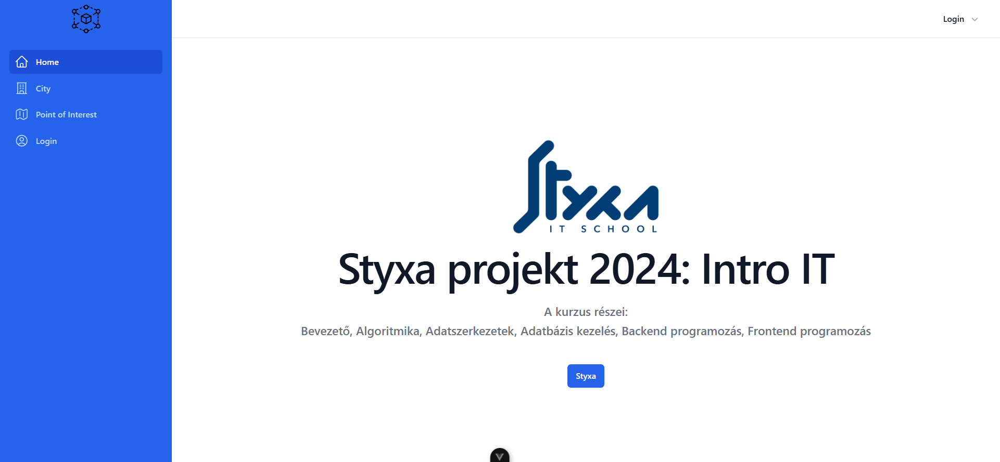

# Styxa projekt - Full-Stack Web App (Vue + Node.js + PostgreSQL)

Ez a projekt a **3 hónapos Styxa IT Intro kurzus zárófeladataként készült**, ahol önállóan építettem fel egy **full-stack webalkalmazást modern technológiákkal** (Tailwind CSS, Vue.js, Node.js/Express, PostgreSQL).

## 🎯 Projekt célja
A felhasználók:
 - bejelentkezhetnek a City oldalra
 - új városokat adhatnak hozzá
 - adatokat tárolhatnak az általuk rögzített városokról
 - egy városra kattintva megtekinthetik annak részletes információit

## 🖼️ Funkciók (képernyőképekkel)

# 1️⃣ Home oldal
 - A főoldal bemutatja a projekt célját és a használt technológiákat.
 - Tartalmaz egy **„Styxa” gombot**, amelyre kattintva a felhasználó átirányítódik a Styxa oldalára.

# 2️⃣ City oldal - Városok listázása

## 🔧 Mit tanultam a projekt fejlesztése során
**Ez a projekt különösen sokat segített a következők mélyebb megértésében:**
 - Vue komponens-struktúra és eseménykezelés
 - API-hívások készítése és kommunikáció a Node.js backenddel
 - Adatbázis-kezelés PostgreSQL-ben
 - Full-stack alkalmazás felépítése a frontendtől a szerverig
 - Tailwind használata gyors UI-készítéshez

## 🚀 Technológiák
 - **Frontend:** Vue 3, Tailwind CSS
 - **Backend:** Node.js, Express
 - **Adatbázis:** PostgreSQL
 - **Kommunikáció:** REST API

## ⚠️ Élő demo

A projekt jelenleg **nem érhető el online**, mert a frontend és backend külön mappában fut és a konfiguráció nem ideális deployhoz.
A projektet **személyesen vagy helyi futtatással** tudom bemutatni.

Gál Sándor
